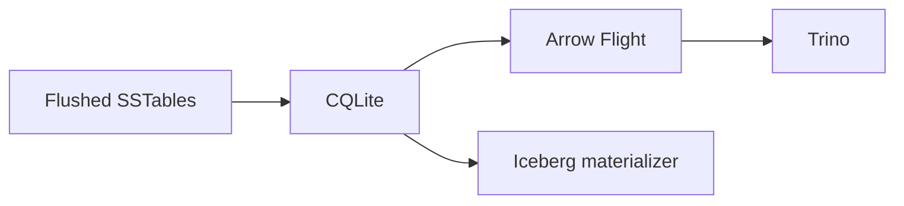
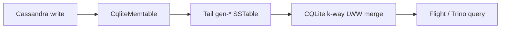
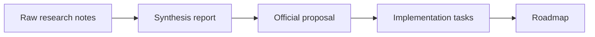

import { Card, CardGrid, LinkCard } from '@astrojs/starlight/components';
import MermaidDiagram from '../../../components/MermaidDiagram.astro';
import storageEngineConcept from '../../../assets/storage-engine-parallel-planes.png';

export const architectureMermaid = `flowchart LR
  subgraph OLTP["Cassandra OLTP Plane"]
    direction TB
    App["Application reads/writes"]
    CommitLog["CommitLog + Memtable"]
    Lifecycle["Flush, compaction, repair"]
    App --> CommitLog --> Lifecycle
  end

  subgraph OLAP["Trino / Iceberg OLAP Plane"]
    direction TB
    ReadApp["Application analytical reads"]
    Query["Trino / Arrow Flight"]
    Iceberg["Iceberg materializer"]
    CQLite["CQLite SSTable reader"]
    ReadApp --> Query --> Iceberg --> CQLite
  end

  subgraph Foundation["SSTable Foundation"]
    direction TB
    Data["Data.db / Index.db Summary.db / Statistics.db"]
    Tail["Optional fresh tail gen-*"]
  end

  Lifecycle -->|flush creates durable SSTables| Data
  Data -->|snapshot read| CQLite
  CommitLog -. optional fresh tail export .-> Tail
  Tail -. fresh tail read .-> CQLite`;

export const dataPathsMermaid = `flowchart TB
  subgraph Cold["Cold path"]
    direction LR
    ColdSST["Flushed SSTables"] --> ColdCQLite["CQLite"] --> ColdOut["Flight / Trino / Iceberg"]
  end

  subgraph Fresh["Fresh tail path"]
    direction LR
    FreshWrite["Cassandra write"] --> FreshTail["Tail gen-*"] --> FreshMerge["CQLite merge"]
  end

  subgraph Research["Research path"]
    direction LR
    Notes["Raw notes"] --> Proposal["Proposal"] --> Roadmap["Tasks + roadmap"]
  end

  ColdOut ~~~ FreshWrite
  FreshMerge ~~~ Notes`;

# Storage Engine Direction

**Status:** Accepted direction, with a proposed freshness spike.

CQLite should sit beside Cassandra as an analytical plane, not replace
Cassandra's internal storage engine. Cassandra remains the OLTP source of truth:
it owns writes, commit log durability, memtables, flush, compaction, repair, and
streaming. CQLite reads the durable SSTable substrate and exposes it to analytical
systems such as Arrow Flight, Trino, and Iceberg.

<figure>
  
  <figcaption>
    Concept visual generated with Imagegen 2. Labels and technical details are
    rendered separately below so they remain exact.
  </figcaption>
</figure>

## Public summary

<CardGrid>
  <Card title="Adjacent, not replacement" icon="puzzle">
    Cassandra has no single storage-engine interface. The write-and-store pieces
    have useful seams, but read merge, lifecycle, streaming, and repair are not
    cleanly swappable.
  </Card>
  <Card title="Use CQLite's strengths" icon="rocket">
    CQLite already understands Cassandra SSTables, serves Arrow Flight, supports
    Trino, exports Parquet, and can materialize lakehouse tables.
  </Card>
  <Card title="Close the freshness gap" icon="sync">
    The remaining gap is Cassandra's unflushed memtable tail. The proposed spike
    exports that tail as real SSTable generations that CQLite can merge normally.
  </Card>
</CardGrid>

## Architecture diagram

<MermaidDiagram
  chart={architectureMermaid}
  size="compact"
  caption="Cassandra owns OLTP reads, writes, and lifecycle. OLAP applications enter through Trino, Arrow Flight, or Iceberg, and CQLite reads the shared SSTable foundation."
  sourceLabel="Mermaid source for the architecture diagram"
/>

## Data paths

<MermaidDiagram
  chart={dataPathsMermaid}
  size="compact"
  caption="The proposal separates runtime data movement from how research is promoted into roadmap work."
  sourceLabel="Mermaid source for the data-path diagram"
/>

### Cold path

Flushed SSTables are the stable, already-shipped read path. CQLite discovers the
table's live generations, reads Cassandra components directly, performs normal
last-write-wins reconciliation, and exposes the result through query and export
surfaces.

Mermaid source for the cold path

### Fresh tail path

Analytical reads do not see Cassandra's unflushed memtable tail today. The
proposed spike uses a Cassandra CEP-11 memtable plugin to export that live tail
on demand as a real `nb` SSTable generation under a tail directory. CQLite then
adds those `gen-*` paths to its normal source list and uses the existing merge
engine unchanged.

Mermaid source for the fresh tail path

### Research path

The public page should not expose raw working notes as the main experience.
Research moves from raw index notes to synthesis reports, then to proposal pages,
then to implementation tasks and roadmap updates.

Mermaid source for the research path

## Decision map

| Decision | Status | Rationale |
|----------|--------|-----------|
| CQLite as an adjacent analytical plane | Accepted direction | It uses the seams Cassandra already exposes and avoids a fork-only storage-engine replacement. |
| CEP-11 memtable tail export | Proposed spike | It targets the real freshness gap while preserving CQLite's existing merge semantics. |
| Full Cassandra storage-engine replacement | Rejected for now | Read merge, lifecycle, repair, and streaming are hardwired around Cassandra's internal objects. |
| CDC as the first spike path | Rejected for now | Earlier reports explored CDC, but the current spike direction is the memtable plugin path. |
| Live FFI reads from Cassandra into CQLite | Deferred | It may reduce export latency later, but it adds a larger runtime and crash-domain surface. |
| Counter-table freshness | Deferred | Counters do not reconcile by simple last-write-wins and are outside the first tail-merge scope. |
| Repair-aware deduplication | Deferred | The first pass is per-node analytical freshness, not cluster repair semantics. |

## Research sources

The website page is intentionally compact. The deeper source material lives in
the repository:

<CardGrid>
  <LinkCard
    title="Storage-engine feasibility"
    description="The replacement-versus-adjacent analysis and the Cassandra seam inventory."
    href="https://github.com/pmcfadin/cqlite/blob/main/docs/storage%20engine/report-2-storage-engine-feasibility.md"
  />
  <LinkCard
    title="Memtable freshness"
    description="The analysis of why flushed SSTables are visible but live memtables are not."
    href="https://github.com/pmcfadin/cqlite/blob/main/docs/storage%20engine/report-1-memtable-freshness.md"
  />
  <LinkCard
    title="CEP-11 memtable plugin design"
    description="The current spike design for exporting the live tail as real SSTable generations."
    href="https://github.com/pmcfadin/cqlite/blob/main/docs/storage%20engine/memtable-plugin-design.md"
  />
</CardGrid>

Primary source paths:

- `docs/storage engine/report-2-storage-engine-feasibility.md`
- `docs/storage engine/report-1-memtable-freshness.md`
- `docs/storage engine/memtable-plugin-design.md`
- `docs/storage engine/proposal.md`
- `docs/storage engine/design.md`
